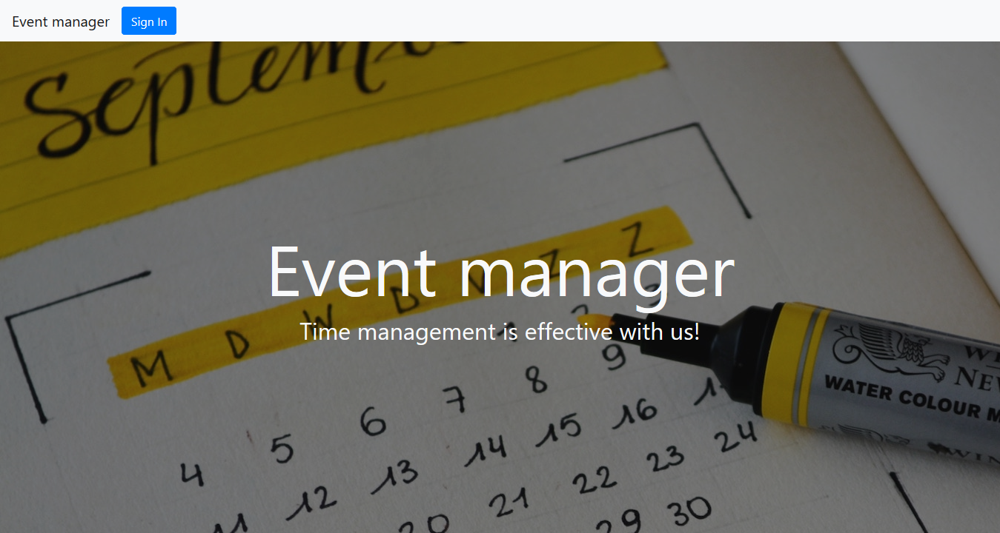
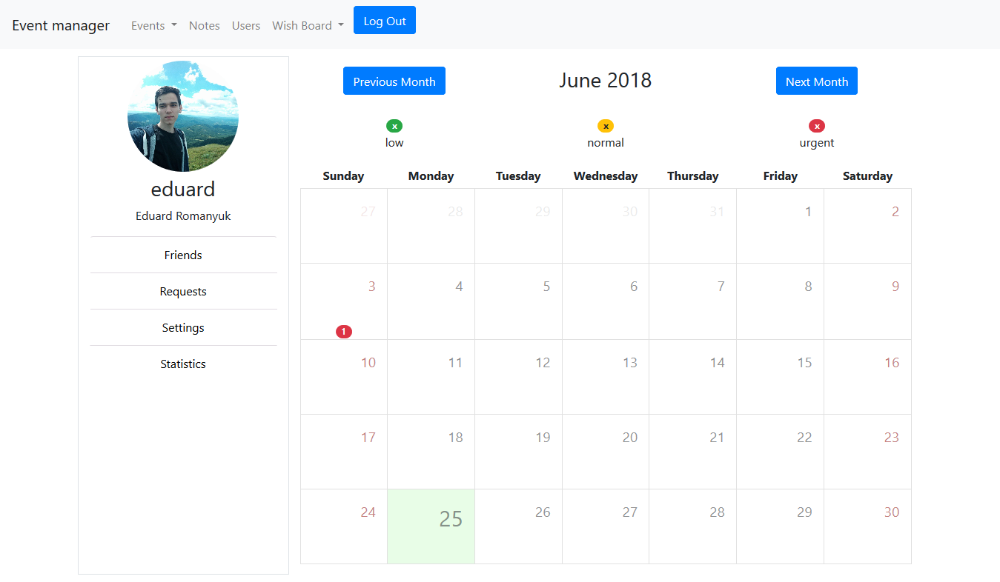
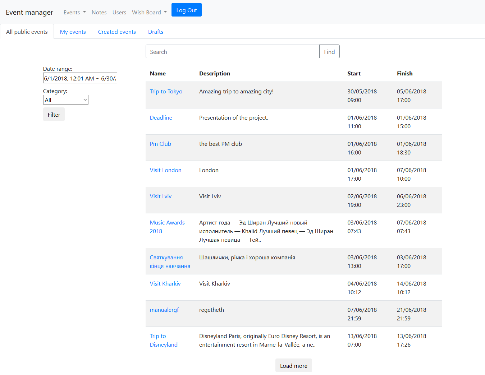

### Event Manager 

#### Description:
Event manager it's a social network based on users events. Main opportunities of user it's creating events (public/private), invite friends to events, add items to his wish list and create notes.
In this project, I was engaged in the development of such modules as authorization and registration of users, restoration of access to the account, lists of events and calendar.

#### Used technologies:
* Java 8
* Spring
* Angular

